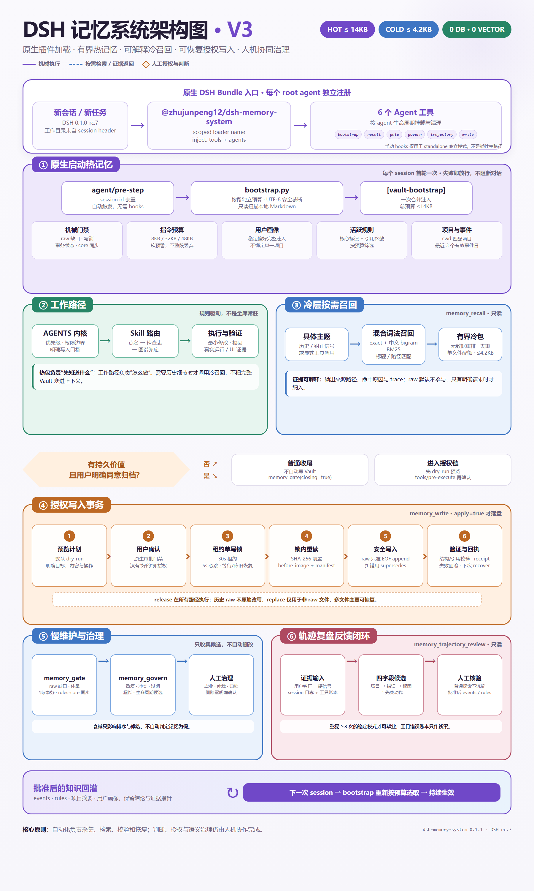
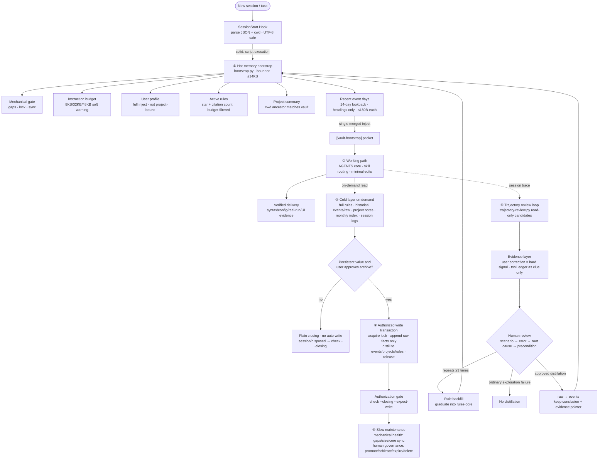

<p align="center">
  
</p>

<div align="center">

# dsh-memory-system

**Give DeepSeek Harness cross-session memory while keeping every fact in local Markdown.**

[](https://github.com/zhujunpeng12/dsh-memory-system/actions/workflows/ci.yml)
[](https://www.npmjs.com/package/@zhujunpeng12/dsh-memory-system)
[](https://github.com/deepseek-ai/deepseek-harness)
[](https://www.python.org/)
[](LICENSE)

[中文](README.md) · [How it works](#why) · [Safety boundaries](#known-limitations-expectation-management) · [Contributing](CONTRIBUTING.md)

</div>

This is not another opaque vector store. It injects a bounded hot packet at session start, opens historical details only through explainable Chinese-aware BM25 recall, and previews every write before a lease-locked recoverable transaction. The default store is `~/.dsh-memory/`; Obsidian, a database, vector service, and external APIs are all optional—not requirements.

> **Privacy boundary:** this repository ships mechanisms, never personal data. Profiles, rules, events, and project notes remain on your machine. Set `MEMORY_VAULT` only when you want to use your own Obsidian Vault.

## Install in 30 seconds

Prerequisites: DeepSeek Harness `0.1.0-rc.7`, Node.js 22/24, and Python 3.10+.

```bash
npx @deepseek-ai/dsh plugin --profile web add github:zhujunpeng12/dsh-memory-system
```

Restart Harness, then ask the agent to run `memory_gate` in a new session. A healthy install returns the gate result and injects `[vault-bootstrap]`; the first run creates the `~/.dsh-memory/` skeleton automatically.

For `Cannot find package`, `ctx.agents`, Python, or missing-bootstrap errors, see [Installation troubleshooting](docs/TROUBLESHOOTING.md).

<details>
<summary>Copy-paste prompt for AI-assisted installation</summary>

```text
Install github:zhujunpeng12/dsh-memory-system into the DeepSeek Harness web profile, restart it, run memory_gate, and verify that a new session receives [vault-bootstrap]. Do not read or upload any private memory content.
```

</details>

## Why this one

| What you care about | Design choice |
|---|---|
| Can I inspect my data? | Local Markdown is the source of truth; review it in any editor or Obsidian |
| Does Chinese recall work? | Exact + CJK bigram BM25 + title/path/project rerank, with sources and trace |
| Can the agent silently rewrite memory? | Writes are dry-run by default and require user confirmation |
| Can concurrent sessions corrupt files? | Single-writer lease, heartbeat, crash recovery, before-images, and receipts |
| Do I need a model/database service? | No background LLM, vector service, or database is required |
| Will memory consume the whole context? | Hot packet ≤14KB, cold packet ≤4.2KB, details on demand |

**Best for:** individuals and small teams that value auditability, local ownership, Chinese recall, and safe writes.

**Not for:** server-side multi-tenancy, high-frequency multi-writer workloads, vector-first semantic retrieval, or fully autonomous unapproved memory writes.

## Why

Agent sessions are amnesic by default. This system turns "memory" into an engineering loop with six layers:

1. **Hot-memory bootstrap** — one ≤14KB packet injected per new session (gate status + instruction budget + user profile + active core rules + project summary + recent event headings)
2. **Working path** — follow global/project `AGENTS.md` rules to complete tasks
3. **Cold recall** — two-gate trigger (history reference + concrete topic), exact + Chinese bigram BM25 + metadata rerank, ≤4.2KB packet, vector retrieval off by default (zero deps)
4. **Authorized writes** — lease lock (30s lease / 5s heartbeat / stale-lock recovery) + multi-file transactions (before-image / SHA-256 precondition / manifest / receipt); raw entries are append-only; corrections require `supersedes`
5. **Slow governance** — `govern.py` read-only scan for duplicates, conflicts, staleness, size, rule lifecycle; never writes
6. **Trajectory review** — read-only scan of session traces using user corrections as the hard signal

## Highlights

| Capability | Description |
|---|---|
| Write safety | Single-writer lease lock + recoverable transactions, atomic multi-file changes, append-only raw |
| Chinese recall | Bigram BM25 + exact/title/path match + metadata rerank, fully explainable trace |
| Byte budgets | 14KB hot / 4.2KB cold hard budgets, UTF-8-safe clipping |
| Read-only governance | L0-L3 boundaries; collects evidence, never auto-deletes |
| Local-first | Zero database / vector service / external service; Python stdlib + Markdown (DSH plugin host, JS/TS wrapper build) |

## System architecture (six-layer closed loop)



<details>
<summary>Expand for editable Mermaid source diagram</summary>



Legend: solid = scripted execution; dashed = on-demand read / human review; diamond = user authorization decision. The feedback loop distills rules and events back into the next session's hot memory.

</details>

## Install as a DSH plugin (recommended, one command)

The plugin form registers memory capabilities directly as agent tools:

```bash
# Install straight from GitHub (no manual env/hooks/vault setup)
npx @deepseek-ai/dsh plugin --profile web add github:zhujunpeng12/dsh-memory-system

# or local development:
npm pack && npx @deepseek-ai/dsh plugin --profile web add ./zhujunpeng12-dsh-memory-system-0.1.1.tgz
```

Restart the Harness. The agent gains 6 tools, and **every new session gets the hot-memory packet injected automatically** (native pre-step listener in index.js — zero manual hooks configuration; disable with `DSH_MEMORY_AUTO_INJECT=false`):

| Tool | Purpose | Writes |
|---|---|---|
| `memory_bootstrap` | ≤14KB hot-memory packet | read-only |
| `memory_recall` | cold recall (exact + Chinese BM25) | read-only |
| `memory_gate` | mechanical gate checks | read-only |
| `memory_govern` | governance candidate scan | read-only |
| `memory_trajectory_review` | trajectory review candidates (user corrections = hard signal) | read-only |
| `memory_write` | authorized transactional write (dry-run default) | confirmed |

`memory_write` only previews by default; it applies only with `apply=true` after explicit user confirmation (enforced via the `tools/pre-execute` hook). All tools locate your vault via `MEMORY_VAULT` / `DSH_HOME`.

**Trajectory review evidence layer (optional companion)**: `memory_trajectory_review` reads the tool-call ledger (`${DSH_HOME}/storages/tool-telemetry.json`). Install the companion plugin `plugins/evidence-ledger/` (zero inject) to accumulate per-session tool calls and errors automatically. Without it, the review still scans session logs for user-correction signals.

> Optional manual hooks (standalone script usage only): see `hooks.example.json` to attach `hook-first-prompt.py` to `UserPromptSubmit`. The plugin form injects automatically — this step is not needed.

## Six layers in detail (what each layer does)

### ① Hot-memory bootstrap — one bounded context per session

**What**: at session start, compress "what the agent most needs to know right now" into one ≤14KB packet and inject it once. No full-vault reads to get started.

**Contents**: mechanical gate status (gaps/lock/sync), instruction-budget audit, user profile, active core rules (star + citation filtered), current project summary (cwd-ancestor match), recent event headings (14-day lookback, ≤180B each).

**How**: `memory_bootstrap` tool, or `python vault-guard/bootstrap.py --cwd <dir> --max-bytes 14000`. Automatic via hooks.

### ② Working path — rules-driven execution (methodology, no script)

**What**: how the agent works, not a script: priority & permission boundaries (system/user > project AGENTS.md > global rules > cold docs), skill routing (named → index table → graph fallback), minimal edits, root-cause investigation, verified delivery (syntax/config/real-run/UI evidence).

**Why no script**: this layer is behavioral policy carried by `AGENTS.md`. The repo ships `templates/` with example rules as a starting point.

### ③ Cold layer on demand — open details only when needed

**What**: when a task needs evidence or details, cold recall opens full sources (complete rules, historical events/raw, project notes, monthly index, session logs).

**Trigger**: two gates — a recall signal (history/last time/correction) **and** a concrete searchable topic, both required. Plain acknowledgements or meta-only follow-ups do not open cold memory.

**How**: `memory_recall` tool, or `python vault-guard/recall.py --query "<q>" --cwd <dir> --force`. Exact + Chinese bigram BM25 + metadata rerank, ≤4.2KB packet with sources and trace.

### ④ Authorized writes — write only when persistent value + user consent

**What**: only "substantive output" (code/doc changes, persistent decisions, user preferences, data conventions, acceptance criteria, standing agreements) with explicit user consent goes through the transactional writer: acquire lease lock → append raw (facts only) → distill into events/projects/rules → release lock.

**Safety**: 30s lease + 5s heartbeat single-writer lock; before-image + SHA-256 precondition + manifest + receipt multi-file transactions; raw append-only (corrections require supersedes); dry-run by default; `tools/pre-execute` confirmation enforced.

**How**: `memory_write` tool (`op=raw/replace/recover`, applies only with `apply=true`).

### ⑤ Slow maintenance — mechanical health checks + human governance

**What**: periodically (or when the vault feels unhealthy): mechanical checks (raw gaps, size limits, rules-core sync, lock state) and human governance (rule graduation, conflict arbitration, expiry archiving, deletion confirmation).

**Boundary**: `govern.py` collects evidence and suggestions only (duplicates/conflicts/staleness/size/lifecycle candidates), **never auto-deletes**. Promotion/archive/deletion always requires a human.

**How**: `memory_govern` tool, or `python vault-guard/govern.py --json --max-items 100`. Pair with `check.py` closing gates (`--closing` / `--closing --expect-write`).

### ⑥ Trajectory review — evidence-driven quality feedback loop

**What**: at wrap-up, scan the session trace for three kinds of items: errors (user corrections = hard signal; AI self-review is self-serving), repeated tool errors (only when frequent), and reusable lessons. Output candidates in the four-field template: scenario → error → root cause → precondition.

**Four required parts (a review is incomplete without all four)**: ① ledger review (quantitative first — per-tool call counts / error rates / weighted cost from `tool-telemetry.json`, diffed against the previous snapshot); ② error review (qualitative — user corrections as hard signal / errors / reusable lessons, four-field template); ③ improvement plan + dispatch question; ④ session temp-file cleanup.

**Dual-scope ledger snapshot**: snapshots must record both global and per-workspace scopes — the workspace scope must include its unknown share; an abnormally high unknown share signals broken attribution, in which case fall back to the global scope for comparisons.

**Evidence**: user-correction signals from session logs + the tool-call ledger from the `evidence-ledger` plugin (which tools fail most). The ledger is a clue, never an automatic verdict.

**Loop**: review produces candidates → propose a plan to lower tool error rates → dispatch the fix (single task → independent sub-agent; multiple improvements → a multi-agent team split by role, using the dependency triple-check / file ownership / accept-on-delivery discipline) → after the fixes land, distill the session trace into events; if the user says "next time", skip the fix and distill directly. After human review, ordinary exploration failures are not distilled; patterns repeating ≥3 times graduate into rules-core — rules and events feed back into the next session's hot memory.

**How**: `memory_trajectory_review` tool, or `python vault-guard/trajectory-review.py --cwd <dir>`. Install `plugins/evidence-ledger/` for ledger data.

## Quick start (3 steps, works out of the box)

### 1. Install

```bash
npx @deepseek-ai/dsh plugin --profile web add github:zhujunpeng12/dsh-memory-system
```

Restart the Harness.

### 2. First run auto-initializes (no manual setup)

The first session automatically:
- creates the memory skeleton at `~/.dsh-memory/` (`memory/{events,index}` + `projects/` + empty `user_profile.md`/`rules.md`), printing `已初始化记忆库于 ...`;
- injects the hot-memory packet on the first prompt (profile/rules/project summary/recent events) — usable memory from the very first session.

No Obsidian needed. The vault is a plain local directory (Python stdlib + Markdown, zero external deps).

### 3. Verify

Ask the agent to run `memory_gate` (mechanical gate checks) to confirm the pipeline. Afterwards every session carries the hot packet automatically; `memory_recall` is used on demand for details.

### Vault mode (optional)

To use Obsidian for visualization, point `MEMORY_VAULT` at your vault and restart:

| Variable | Default | Meaning |
|---|---|---|
| `MEMORY_VAULT` | `~/.dsh-memory` | Vault root (must contain `memory/` and `projects/`) |
| `DSH_HOME` | `~/.dsh` | DSH home (hooks config, storages) |

```powershell
$env:MEMORY_VAULT = "C:\Users\you\Documents\Obsidian Vault"
```

Copy the `templates/vault/` skeleton into your vault (see `templates/README.md`).

### Standalone script usage (without the plugin)

```bash
python vault-guard/bootstrap.py --cwd /path/to/project --max-bytes 14000   # hot packet
python vault-guard/recall.py --query "continue the previous X" --cwd /path/to/project --force  # cold recall
```

## Repository layout

```
├── index.js                    # DSH host plugin: 6 memory tools + hot-packet auto-inject + write guard
├── package.json                # npm package (dsh-memory-system)
├── dsh.plugin.json             # DSH plugin manifest
├── cordis.patch.yml            # DSH bundle patch
├── vault-guard/                # Python core (bootstrap/recall/gate/govern/write/...)
├── templates/                  # sanitized memory-vault skeleton
├── hooks.example.json          # DSH hooks example
├── .env.example
└── LICENSE                     # MIT
```

## Run tests

```bash
# Python engine tests
cd vault-guard && python -m unittest discover -p "test_*.py" -v

# JS contract tests (tool args → CLI argv mapping; run from repo root)
node --test test_plugin_bridge.test.mjs
# or everything at once (CI-equivalent):
npm run check
```

All tests use temporary directories; they never touch a real vault.

## Known limitations (expectation management)

- **`memory_write` is dry-run by default**: nothing is written unless `apply=true` is explicitly set and the user confirms. "The agent said it remembered" does not mean it was persisted — verify with `memory_gate` or by checking the events files.
- **Cold recall is BM25 keyword retrieval, not semantic vectors**: best for exact/near-exact matches (proper nouns, code, dates, concrete topics); weak on paraphrases, long-tail phrasing, and cross-language recall. Vector retrieval is off by default (the cost of zero dependencies).
- **Single-writer lease lock**: only one writer at a time per memory vault; concurrent multi-agent writes serialize (queue for the lock). Not suited for many agents writing the same vault at high frequency — split vaults or stagger writes.
- **Project isolation is cwd-ancestor matching only, no git-branch awareness**: different git branches of the same directory share the same memory; branch-specific memory is not separated. Branch-level isolation is on the roadmap (below).
- **Hot packet is injected once per session**: mid-session memory writes do not auto-refresh the current session's packet; call `memory_recall` / `memory_bootstrap` explicitly when needed.
- **The quantitative dimension of trajectory review depends on the companion plugin**: without `plugins/evidence-ledger/`, the review scans session logs for user-correction signals (qualitative) only — no tool-ledger data.

## Roadmap

- Git-branch awareness: memory bound to "only effective on a given branch" (aligning with dsh-memory-evolve's branch isolation)
- Semantic recall as an optional channel (keeping zero-dependency BM25 as default)
- Multi-writer concurrency improvements (the single-writer lock is a correctness-first design choice today)

## Methodology (the philosophy)

- **Single source of truth**: one fact, one home (runtime params → AGENTS.md; decisions → project notes; daily flow → events; cross-project lessons → rules). Everywhere else holds pointers only.
- **Write authorization**: preview first, `--apply` only with explicit consent; raw append-only; corrections via `supersedes`.
- **Governance is read-only**: `govern.py` collects evidence and suggestions; promotion/archive/deletion always requires a human.

## Contributing

See [CONTRIBUTING.md](CONTRIBUTING.md). Security issues: see [SECURITY.md](SECURITY.md).

## License

MIT — see [LICENSE](LICENSE). Copyright © 2026 [zhujunpeng12](https://github.com/zhujunpeng12).

## Attribution

This project is created and maintained by [zhujunpeng12](https://github.com/zhujunpeng12). If it helps you — whether you use it in a product, build on it, or reference the six-layer memory loop in an article or talk — you are warmly invited to:

- Credit the project in your README, about page, or public material
- Tell the author how you use it via email <312076183@qq.com> — it is genuinely appreciated to see it in real environments

MIT does not require any of this, but your acknowledgement is the most tangible return for open source.

**Upstream acknowledgement**: the "trajectory review → multi-agent dispatch" methodology in this repository builds on [NanmiCoder/dsh-agent-teams](https://github.com/NanmiCoder/dsh-agent-teams) (MIT) — a multi-agent team orchestration plugin for DeepSeek Harness. Enhancements practiced and distilled on top of it here: demand-brief gating (brief submission + panel confirmation + dispatch blocking), orchestration correction (editable dependencies / captain self-claim), captain protocol (progressive acceptance / dependency triple-check / file ownership / new-demand-as-task), and UI state machines (ripple phases / queued amber state). Thanks to the original author.

## Disclaimer

- This repository contains no personal data; memory content stays on the user's machine.
- Review your vault layout, hooks wiring, and security boundaries before deploying.
