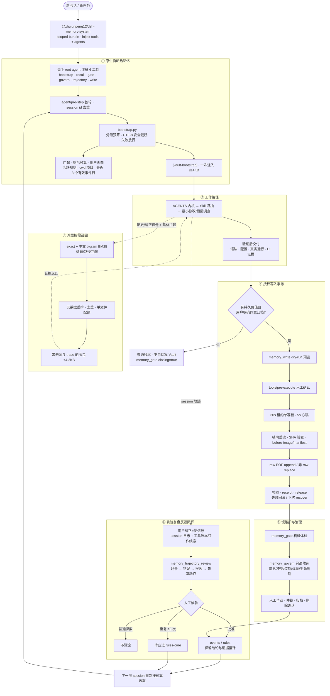

<p align="center">
  
</p>

<div align="center">

# dsh-memory-system

**让 DeepSeek Harness 跨会话记住项目、规则和纠正，同时把数据留在本机 Markdown。**

[](https://github.com/zhujunpeng12/dsh-memory-system/actions/workflows/ci.yml)
[](https://www.npmjs.com/package/@zhujunpeng12/dsh-memory-system)
[](https://github.com/deepseek-ai/deepseek-harness)
[](https://www.python.org/)
[](LICENSE)

[English](README.en.md) · [工作原理](#为什么需要它) · [安全边界](#已知限制预期管理) · [参与贡献](CONTRIBUTING.md)

</div>

它不是另一个黑盒向量库：启动时只注入有预算的热记忆，需要历史细节时才做可解释的中文 BM25 召回；所有写入默认预览，并通过租约锁、before-image、SHA-256 前置条件和回执保护。默认使用 `~/.dsh-memory/`，无需 Obsidian、数据库、向量服务或外部 API。

> **隐私边界**：仓库只包含机制，不包含任何个人数据。画像、规则、事件和项目笔记始终留在使用者本机；也可用 `MEMORY_VAULT` 指向自己的 Obsidian Vault。

## 30 秒安装

前提：已安装 DeepSeek Harness `0.1.0-rc.7`，Node.js 22/24 与 Python 3.10+ 可用。

```bash
npx @deepseek-ai/dsh plugin --profile web add github:zhujunpeng12/dsh-memory-system
```

重启 Harness 后，在新会话让 Agent 运行 `memory_gate`。成功时会看到门禁结果，并且首轮上下文包含 `[vault-bootstrap]`；首次运行会自动创建 `~/.dsh-memory/` 骨架。

遇到 `Cannot find package`、`ctx.agents` 或热包未注入，请看 [安装故障排查](docs/TROUBLESHOOTING.md)。

<details>
<summary>AI 代装提示（复制整句给你的 Agent）</summary>

```text
请把 github:zhujunpeng12/dsh-memory-system 安装到 DeepSeek Harness 的 web profile，重启后运行 memory_gate，并确认新会话收到 [vault-bootstrap]。不要读取或上传任何私人记忆内容。
```

</details>

## 为什么选它

| 你关心的事 | 本项目的取舍 |
|---|---|
| 数据能否直接看懂 | 事实源是本机 Markdown，可用编辑器或 Obsidian 审阅 |
| 中文历史能否召回 | exact + 中文 bigram BM25 + 标题/路径/项目重排，返回来源和 trace |
| Agent 会不会乱写记忆 | 写操作默认 dry-run；用户确认后才进入可恢复事务 |
| 多会话会不会写坏文件 | 单写者租约锁、心跳、崩溃恢复、before-image 与提交回执 |
| 是否需要模型或数据库服务 | 不需要；默认零后台 LLM、零向量服务、零数据库 |
| 上下文会不会越积越重 | 热包 ≤14KB、冷包 ≤4.2KB，细节按需打开 |

**适合**：重视可审计、本地优先、中文召回和写入安全的个人/小团队 DSH 工作流。

**不适合**：需要多租户服务端、高频多写者、默认语义向量或全自动无审批记忆写入的场景。

## 为什么需要它

Agent 会话之间默认是失忆的。本系统用 **六层机制** 把「记忆」变成可工程化的闭环：

1. **启动热记忆** — 每个新会话注入一次 ≤14KB 的热包（门禁 + 指令预算 + 用户画像 + 活跃规则 + 项目摘要 + 近期事件标题）
2. **工作路径** — 按全局/项目 `AGENTS.md` 规则完成任务
3. **冷层召回** — 双门槛触发（历史引用 + 具体主题），exact + 中文 BM25 + 元数据重排，输出 ≤4.2KB 冷包，向量检索默认关闭（依赖零）
4. **授权写入** — 租约锁（30s 租约 / 5s 心跳 / 陈旧锁恢复）+ 多文件事务（before-image / SHA-256 前置 / manifest / receipt），raw 机械只追加，纠错必须 supersedes
5. **慢治理** — `govern.py` 只读扫描重复、冲突、过期、体量、规则生命周期候选，默认不写
6. **轨迹复盘** — 只读扫描会话轨迹，用「用户纠正」作为硬信号产出复盘候选

## 特性亮点

| 能力 | 说明 |
|---|---|
| 写入安全 | 单写者租约锁 + 可恢复事务，多文件变更原子化，raw 只追加不覆写 |
| 中文召回 | 中文 bigram BM25 + exact/标题/路径匹配 + 元数据重排，全程可解释 trace |
| 字节预算 | 热包 14KB / 冷包 4.2KB 硬预算，UTF-8 安全截断 |
| 治理只读 | L0-L3 边界，自动收集证据、永不自动删改 |
| 本地优先 | 零数据库 / 零向量服务 / 零外部服务依赖；Python 标准库 + Markdown（插件宿主 DSH，构建产物为 JS/TS 包裹） |

## 系统架构（六层闭环）


可维护图源：[HTML/CSS V3 源图](docs/memory-system-flowchart.html)。

<details>
<summary>展开查看可编辑的 Mermaid 源码图（与 V3 PNG 同步）</summary>



图例:实线 = 脚本机械执行;虚线 = 按需读取 / 人工核验;菱形 = 用户授权判断。反馈闭环:轨迹复盘产出的规则与事件,回灌到下一次会话的热记忆。

</details>

## 六层职责详解（每一层做什么）

### ① 启动热记忆 — 每个会话一次的有界上下文

**做什么**：新会话开始时，把「此刻最该知道的记忆」压缩成一个 ≤14KB 热包一次注入，让 Agent 不读全库也能带着上下文开工。

**包含**：机械门禁状态（缺口/锁/同步）、指令预算审计、用户画像、活跃核心规则（按 ⭐ 与引用计数筛选）、当前项目摘要（按 cwd 祖先匹配）、最近事件主标题（14 天回溯、单条 ≤180B）。

**怎么用**：`memory_bootstrap` 工具，或 `python vault-guard/bootstrap.py --cwd <项目目录> --max-bytes 14000`。推荐插件形态通过原生 `agent/pre-step` 在每个 session 首轮自动执行；手动 hooks 仅用于 standalone 兼容模式。

### ② 工作路径 — 按规则执行任务（方法论层，无脚本）

**做什么**：这是「Agent 怎么干活」的约定，不是脚本——热包注入后，Agent 按优先级与权限边界执行：系统/用户指令 > 项目 AGENTS.md > 全局规则 > 冷文档；技能路由（点名 → 速查表 → 图谱兜底）；最小修改、根因调查；交付前验证（语法/配置/真实运行/界面证据）。

**为什么没有脚本**：这一层是行为规范，由 `AGENTS.md` 承载。开源版提供 `templates/` 里的示例规则作为起点，使用者按自己的团队文化改写。

### ③ 冷层按需读取 — 需要细节才打开

**做什么**：热包只有摘要，当任务需要证据或细节时，冷召回按需打开完整来源（完整规则、历史 events/raw、项目主笔记、月度索引、session 日志）。

**触发**：双门槛——同时满足「历史/上次/纠正等召回信号」+「可检索的具体主题」才触发；纯确认语、复测元指令不打开。

**怎么用**：`memory_recall` 工具，或 `python vault-guard/recall.py --query "<问题>" --cwd <目录> --force`。exact + 中文 bigram BM25 + 元数据重排，输出 ≤4.2KB 冷包并附来源与 trace。

### ④ 授权写入 — 有持久价值且用户同意才写

**做什么**：只有「实质产出」（代码/文档变更、持久决策、用户偏好、数据口径、验收标准、下次仍需遵守的约定）且用户同意归档时，才走事务写入：拿租约锁 → 写 raw（只记事实不评价）→ 提炼归位（events/项目/rules/toolmap）→ 释放锁。

**安全机制**：30s 租约 + 5s 心跳单写者锁、before-image + SHA-256 前置 + manifest + receipt 多文件事务、raw 机械只追加（纠错必须 supersedes）、默认 dry-run、`tools/pre-execute` 强制确认。

**怎么用**：`memory_write` 工具（`op=raw/replace/recover`，`apply=true` 才落盘）。

### ⑤ 慢维护 — 机械体检 + 人工治理

**做什么**：定期（或怀疑记忆库不健康时）做两件事——机械体检：raw 缺口、体量超线、rules-core 同步、写锁状态；人工治理：规则毕业、冲突仲裁、过期归位、删除确认。

**边界**：`govern.py` 只收集证据与建议（重复/冲突/过期/体量/生命周期候选），**永不自动删改**；晋升/归档/删除永远需要人确认。

**怎么用**：`memory_govern` 工具，或 `python vault-guard/govern.py --json --max-items 100`。配合 `check.py` 的收尾门禁（`--closing` / `--closing --expect-write`）使用。

### ⑥ 轨迹复盘 — 证据驱动的质量反馈闭环

**做什么**：收尾时回溯会话轨迹，找三类点：错误（用户纠正 = 硬信号；AI 自评有自我辩护倾向）、error（仅频繁时写）、可借鉴。产出按「场景 → 错误 → 根因 → 先决动作」四字段模板的复盘候选。

**复盘四要素（缺一不算做完）**：①工具账本复盘（定量先行——`tool-telemetry.json` 各工具调用次数/错误次数/错误率/加权成本，与上轮快照做差值）；②错误复盘（定性——用户纠正硬信号/error/可借鉴，四字段模板）；③优化方案 + 派发询问；④会话临时文件清理。

**账本双口径**：快照必须记全局 + 工作区双口径——工作区口径须含 unknown 占比，unknown 异常高 = 归属失效信号，差值不可比时改全局口径。

**证据来源**：session 日志中的用户纠正信号 + `evidence-ledger` 插件的工具调用账本（谁的工具最常出错）。账本只作线索，不自动判错。

**闭环**：复盘出候选 → 给出降低工具错误率的方案 → 派发解决（单一任务 → 独立子 agent；优化点多 → 多 agent 团队按角色分工，依赖三问/文件所有权/交付即验收）→ 解决完成后解析会话轨迹写入 events；用户说「下次再处理」→ 跳过解决、直接写入 events。人工核验后，普通探索失败不沉淀；重复 ≥3 次的模式毕业进 rules-core——规则与事件回灌到下一次会话的热记忆，形成进化闭环。

**怎么用**：`memory_trajectory_review` 工具，或 `python vault-guard/trajectory-review.py --cwd <目录>`。配套安装 `plugins/evidence-ledger/` 才有工具账本数据；多 agent 派发执行件见 `plugins/agent-teams/`（基于 [NanmiCoder/dsh-agent-teams](https://github.com/NanmiCoder/dsh-agent-teams) 的增强 fork）。

## 作为 DSH 插件安装（推荐，一行命令）

插件形态把记忆能力直接注册为 Agent 工具，并随 DSH 装配自动生效：

```bash
# 从 GitHub 直接安装（无需手动配环境/hooks/Vault 目录）
npx @deepseek-ai/dsh plugin --profile web add github:zhujunpeng12/dsh-memory-system

# 或本地开发安装
npm pack            # 生成 tarball
npx @deepseek-ai/dsh plugin --profile web add ./zhujunpeng12-dsh-memory-system-0.1.1.tgz
```

安装后重启 Harness，Agent 自动获得 6 个记忆工具，且**每个新会话自动注入热记忆包**（index.js 原生监听 pre-step，零手动 hooks 配置；`DSH_MEMORY_AUTO_INJECT=false` 可关闭）：

| 工具 | 作用 | 写操作 |
|---|---|---|
| `memory_bootstrap` | 生成 ≤14KB 热记忆包 | 只读 |
| `memory_recall` | 冷召回（exact + 中文 BM25） | 只读 |
| `memory_gate` | 机械门禁检查 | 只读 |
| `memory_govern` | 治理候选扫描 | 只读 |
| `memory_trajectory_review` | 轨迹复盘候选（用户纠正 = 硬信号） | 只读 |
| `memory_write` | 授权事务写入（默认 dry-run） | 需确认 |

`memory_write` 默认只预览，`apply=true` 且经用户确认后才落盘；`tools/pre-execute` 钩子会强制弹确认。所有工具通过 `MEMORY_VAULT` / `DSH_HOME` 环境变量定位你的记忆库（不设置则用默认值，见下）。

**轨迹复盘证据层（可选配套）**：`memory_trajectory_review` 依赖工具调用账本（`${DSH_HOME}/storages/tool-telemetry.json`）。安装配套插件 `plugins/evidence-ledger/`（工具账本，零 inject）后，每个会话的工具调用与错误会自动累计，复盘才有数据可扫。不装则复盘只扫 session 日志中的用户纠正信号。

## 快速开始（3 步，装完即用）

### 1. 安装

```bash
npx @deepseek-ai/dsh plugin --profile web add github:zhujunpeng12/dsh-memory-system
```

重启 Harness。

### 2. 首次运行自动初始化（无需任何手动配置）

第一次会话自动完成两件事：
- 在默认位置 `~/.dsh-memory/` 创建记忆库骨架（`memory/{events,index}` + `projects/` + 空 `user_profile.md`/`rules.md`），控制台打印 `已初始化记忆库于 ...`；
- 该会话首轮自动注入热记忆包（画像/规则/项目摘要/近期事件），开箱即有记忆。

不装 Obsidian 也能完整使用；记忆库是普通本地目录（Python 标准库 + Markdown，零外部依赖）。

### 3. 验证

让 Agent 执行 `memory_gate`（机械门禁检查）确认链路正常；之后每次会话自动带热包，需要细节时 Agent 会用 `memory_recall` 冷召回。

### Vault 模式（可选）

想用 Obsidian 可视化时，设置环境变量指向你的 Vault，重启后记忆切换到 Vault：

| 变量 | 默认值 | 说明 |
|---|---|---|
| `MEMORY_VAULT` | `~/.dsh-memory` | 记忆库根目录（含 `memory/` 与 `projects/`） |
| `DSH_HOME` | `~/.dsh` | DSH 家目录（hooks 配置、storages 等） |

```powershell
$env:MEMORY_VAULT = "C:\Users\you\Documents\Obsidian Vault"
```

Vault 模式下把 `templates/vault/` 骨架复制到你的 Vault（见 `templates/README.md`）。

### 独立脚本用法（不装插件时）

```powershell
python vault-guard\bootstrap.py --cwd "C:\path\to\project" --max-bytes 14000   # 热包
python vault-guard\recall.py --query "继续上次的XXX" --cwd "C:\path\to\project" --force  # 冷召回
```

> 手动 hooks（可选，仅独立脚本用法需要）：参考 `hooks.example.json` 把 `hook-first-prompt.py` 挂到 `UserPromptSubmit`；插件用法已内置自动注入，无需此步。`DSH_HOME` 环境变量仍用于定位 DSH 运行时存储（storages/sessions 等），脚本自身互相调用则用包内相对路径——插件装到哪里都能跑，无需把 vault-guard 复制到 `$DSH_HOME`。

## 目录结构

```
├── index.js                    # DSH host 插件：6 个记忆工具 + 写操作护栏
├── package.json                # npm 包声明（dsh-memory-system）
├── dsh.plugin.json             # DSH 插件 manifest
├── cordis.patch.yml            # DSH bundle 装配补丁
├── vault-guard/
│   ├── bootstrap.py            # 热记忆包生成（≤14KB）
│   ├── hook-first-prompt.py    # UserPromptSubmit hooks：按 session 注入一次热包 + 冷包触发
│   ├── hook-session-start.py   # SessionStart 兼容桥（当前默认不启用）
│   ├── recall.py               # 冷召回：exact + 中文 BM25 + 元数据重排
│   ├── recall_trigger.py       # 召回信号双门槛判断
│   ├── check.py                # 机械门禁（开场/收尾检查）
│   ├── sync-core.py            # rules.md → rules-core.md 事务同步
│   ├── vault_lock.py           # 30s 租约 / 5s 心跳单写者锁
│   ├── vault-lock.py           # 锁的兼容 CLI（acquire/release/status）
│   ├── vault_tx.py             # 可恢复事务：before-image/哈希前置/manifest/receipt
│   ├── vault-write.py          # 授权写入 CLI（raw 只追加，dry-run 默认）
│   ├── rule-cite.py            # 规则引用计数（dry-run 默认）
│   ├── govern.py               # 只读治理扫描（重复/冲突/过期/体量/生命周期）
│   ├── trajectory-review.py    # 轨迹复盘候选（用户纠正 = 硬信号）
│   └── test_*.py               # 回归测试（unittest，无外部依赖）
├── plugins/
│   ├── evidence-ledger/        # 配套插件：工具调用账本（轨迹复盘证据层）
│   └── agent-teams/            # 配套插件：多 agent 团队编排（增强 fork，复盘派发执行件）
├── templates/                  # 脱敏记忆库骨架（10 分钟搭出自己的记忆系统）
├── hooks.example.json          # DSH hooks 装配示例
├── .env.example                # 环境变量示例
└── LICENSE
```

## 运行测试

```powershell
# Python 引擎测试
cd vault-guard
python -m unittest discover -p "test_*.py" -v

# JS 契约测试（工具参数 → CLI argv 映射，仓库根执行）
node --test test_plugin_bridge.test.mjs
# 或一次性跑全量（等价 CI）
npm run check
```

测试全部使用临时目录，不触碰真实记忆库。

## 已知限制（预期管理）

- **`memory_write` 默认是 dry-run（预览）**：不显式 `apply=true` 且经用户确认，**不落盘**。「Agent 说记下了」≠ 真写入了——需要时用 `memory_gate`/查看 events 文件确认。
- **冷召回是 BM25 关键词检索，不是语义向量**：适合精确/近精确匹配（专有名词、代码、日期、明确主题），对同义改写、长尾表达、跨语言召回有限；向量检索默认关闭（零依赖代价）。
- **单写者租约锁**：同一记忆库同一时刻只有一个写者，多 Agent 并发写会串行化（等锁）。不适合多 Agent 高频同时写同一个记忆库——多写者场景请拆分记忆库或错峰。
- **项目隔离仅按 cwd 祖先匹配，无 git 分支感知**：同一目录的不同 git 分支共享同一记忆库，分支间的记忆会互相可见。分支级隔离在路线图中（见下）。
- **热包按会话注入一次**：会话中途的「新增记忆」不会自动进当前会话热包，需要时显式调用 `memory_recall`/`memory_bootstrap` 刷新。
- **轨迹复盘的定量维度依赖配套插件**：不装 `plugins/evidence-ledger/` 时只扫 session 日志中的用户纠正信号（定性），无工具账本数据。

## 路线图

- git 分支感知：记忆可绑定「仅在某分支生效」（对齐 dsh-memory-evolve 的分支隔离能力）
- 语义召回作为可选通道（默认仍保持零依赖 BM25）
- 多写者并发优化（当前单写者锁是正确性优先的设计取舍）

## 使用约定（方法论）

- **单一真相源**：一条事实只有一个家（运行参数 → AGENTS.md；决策历史 → 项目笔记；当日流水 → events；跨项目经验 → rules），其他位置只放指针
- **写入授权**：所有写操作先 dry-run 预览，明确授权后才 `--apply`；raw 只追加，纠错用 supersedes 而非覆写
- **治理默认只读**：`govern.py` 只收集证据和建议，晋升/归档/删除永远需要人确认

## 许可证

MIT — 详见 [LICENSE](LICENSE)。版权所有 © 2026 [zhujunpeng12](https://github.com/zhujunpeng12)。

## 引用与致谢

本项目由 [zhujunpeng12](https://github.com/zhujunpeng12) 创建并维护。如果它帮助到了你——在你的产品里使用了它、基于它做了二次开发、或在文章 / 分享中引用了这套「六层记忆闭环」的理念——欢迎：

- 在你项目的 README、关于页或公开材料中署名致谢
- 通过邮件 <312076183@qq.com> 告知作者你的使用场景，作者很乐意看到它被用在真实环境里

MIT 许可不强制这些，但你的致谢是对开源最实在的回馈。

**上游致谢**：本仓库「轨迹复盘 → 多 agent 派发解决」的方法论受益于 [NanmiCoder/dsh-agent-teams](https://github.com/NanmiCoder/dsh-agent-teams)（MIT 许可）——一个为 DeepSeek Harness 提供多 agent 团队编排的插件。本仓库在其基础上实践并沉淀的增强方向：需求确认单门禁（brief 提交 + 面板确认 + 派活拦截）、编排纠错（依赖可改 / 队长可认领）、队长协议（渐进式验收 / 依赖三问 / 文件所有权 / 追加需求建任务）、UI 状态机（波纹相位 / 待命橙色态）等，供同样做多 agent 编排的同仁参考。感谢原作者的贡献。

## 免责声明

- 本仓库不含任何个人数据；记忆内容始终留在使用者本地
- 使用前请自行审查：部署前确认你的记忆库结构、hooks 装配与安全边界
